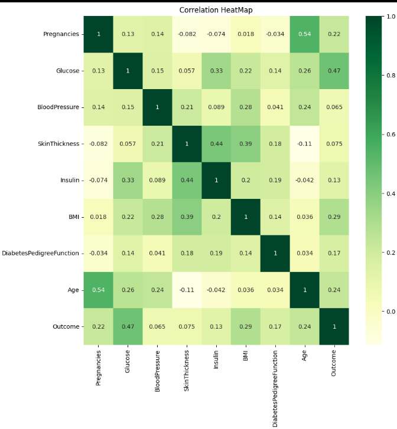

# Diabetes Prediction using KNN

This project predicts diabetes using the K-Nearest Neighbors (KNN) algorithm.  
It includes data preprocessing, correlation heatmap, model building, and accuracy checking.

## Features
- Data cleaning
- Correlation heatmap
- K value comparison
- KNN model training
- Accuracy evaluation

## Screenshots

